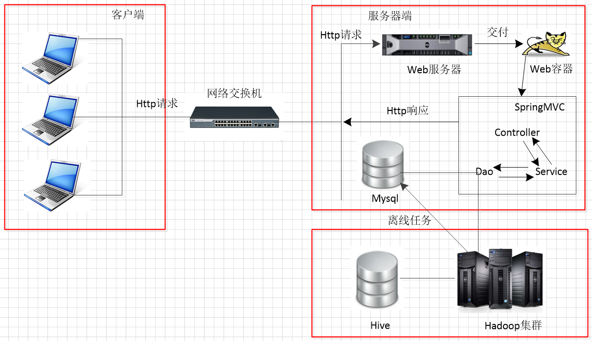

开发架构
=============

[TOC]
## 1. 开发语言

### 1.1 后端开发语言 
Java

### 1.2 前端开发语言 
html, css, js

## 2. 开发框架

### 2.1 后端开发框架
Spring+SpringMVC+Mybatis(Hive) 

SSM（Spring+SpringMVC+Mybatis），目前较为主流的企业级架构方案。 
标准的MVC设计模式，将整个系统划分为View层、Controller层、Service层、Dao层四层， 
使用SpringMVC负责请求的转发和视图管理， 
Spring实现业务对象管理, 
MyBatis和Hive作为数据对象持久化引擎。

### 2.2 定时任务
采用springframework.scheduling.quartz

### 2.3 异步任务
org.springframework.scheduling.concurrent.ThreadPoolTaskExecutor 
采用线程池的方式， 
不需要返回值的异步任务实现Runnable接口，扔到线程池； 
需要返回值的任务实现Callable接口，扔到线程池，通过Future.get()获取返回结果；

### 2.4 大数据离线任务
Hive On Spark

### 2.5 包结构

*  ecust.shgas.controller

> 负责具体的业务模块流程的控制,在此层里面要调用Service层的接口来控制业务流程

*  ecust.shgas.service

> Service层主要负责业务模块的逻辑应用设计; 
Service层的业务实现，具体要调用到已定义的Dao层的接口， 
封装Service层的业务逻辑有利于通用的业务逻辑的独立性和重复利用性

*  ecust.shgas.dao.mysql

> Dao层主要是做数据持久层的工作，负责与Mysql数据库进行联络的一些任务。

*  ecust.shgas.dao.hive

> Dao层主要是做数据持久层的工作，负责与Hive进行联络的一些任务。

*  ecust.shgas.domain

> 业务模型对象的定义

*  ecust.shgas.task
> 定时任务和异步任务

### 2.2 前端开发框架
EChart

## 3. 开发环境
### 3.1 IDE
IntelliJ IDEA

### 3.2 项目构建
使用Maven作为项目管理，包依赖以及自动构建工具

### 3.2 服务器
网络服务器: Linux 
Web服务器: Tomcat 
Servlet容器: Tomcat 
 
### 3.2 版本控制
Git 
项目暂托管于github

### 3.2 文档编写
Markdown

## 4.数据存储
小规模数据存储于MySQL 
大规模数据存储于Hive 
Hive的MetaData存储于MySQL,同时对大规模数据量Hive计算后，将生成的数据存储于MySQL

## 5. 项目架构图
